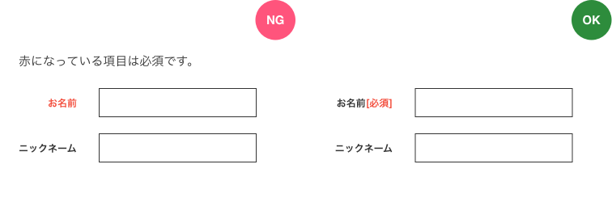
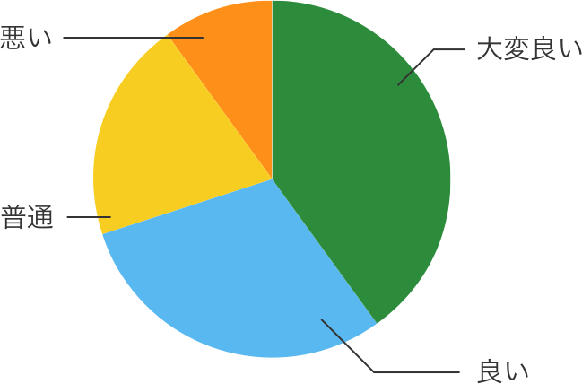
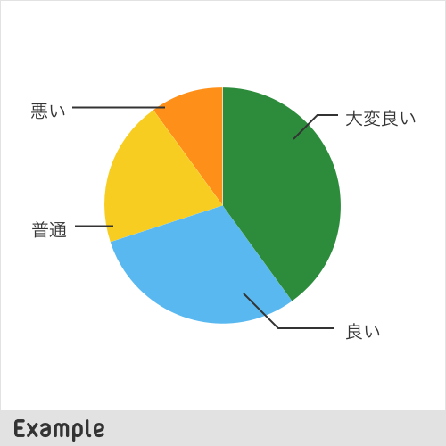

### 1.4.1 色の使用

#### 1. 方針
色だけで情報や動作を促すような表現をしない。色だけでなくテキストや記号でも伝えるようにする。

#### 2. 詳細
- 赤はエラー終了、青は正常終了、必須項目は赤色など、色だけで表現せず、テキストを併用する

NGのように色で情報を伝えていると、赤色が区別しづらい人にはどれが必須かわからない。

- 色や要素だけでなく、ラベルで指し示す

ラベルがないと色の差がわからない場合、理解ができない。

#### 3. レビュー・テスト方法
- 上記例の画像のような部分はないか
- 円グラフ、カレンダーのUIを作った時は要注意
- Sketchのコントラスト、色弱者向けチェック([stark](http://www.getstark.co/))
- Chromeのコントラストチェック([use contrast](https://chrome.google.com/webstore/detail/chromelens/idikgljglpfilbhaboonnpnnincjhjkd))
- Photoshopの場合は、 表示＞構成設定＞P型・D型 からシミュレーションできる（参考：[色弱者向けのCUDソフトプルーフ（擬似変換）機能](https://www.adobe.com/jp/joc/pscs4/showcase/vol02/tips/)）

#### 4. 実装方法
#### 5. 参考文献
- WCAG 2.0対応項目：原文 [Guideline 1.4.1 Use of Color:](https://www.w3.org/TR/UNDERSTANDING-WCAG20/visual-audio-contrast-without-color.html)
- WCAG 2.0対応項目：和訳 [色の使用:達成基準 1.4.1 を理解する](http://waic.jp/docs/UNDERSTANDING-WCAG20/visual-audio-contrast-without-color.html)
